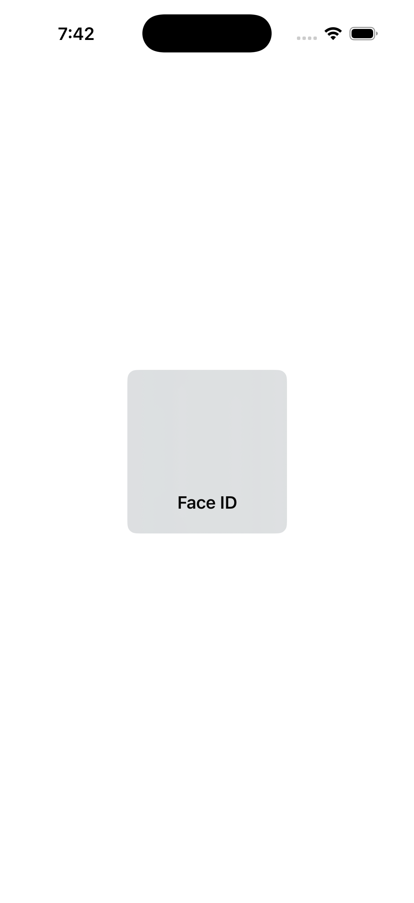
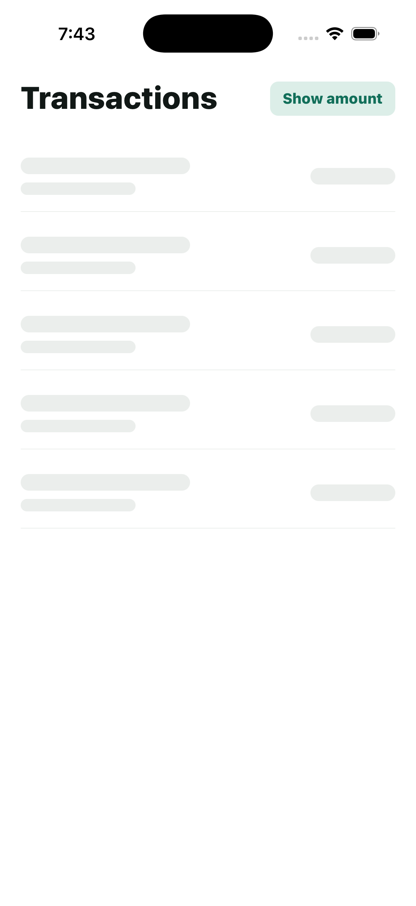
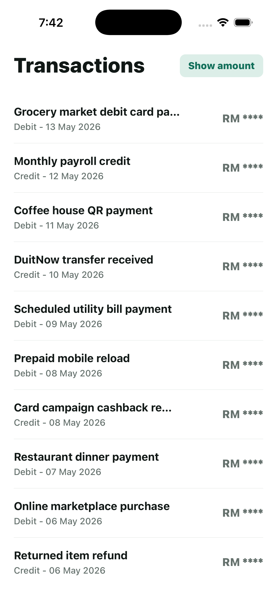
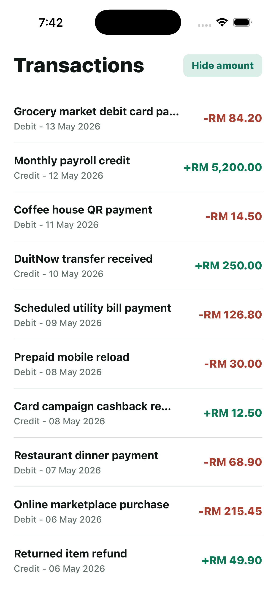
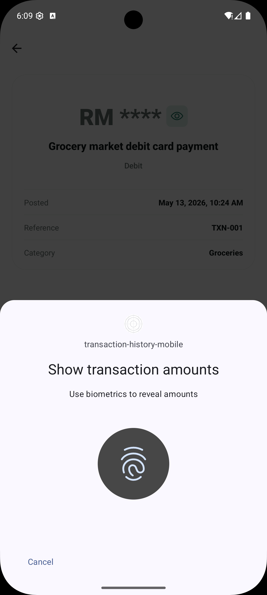
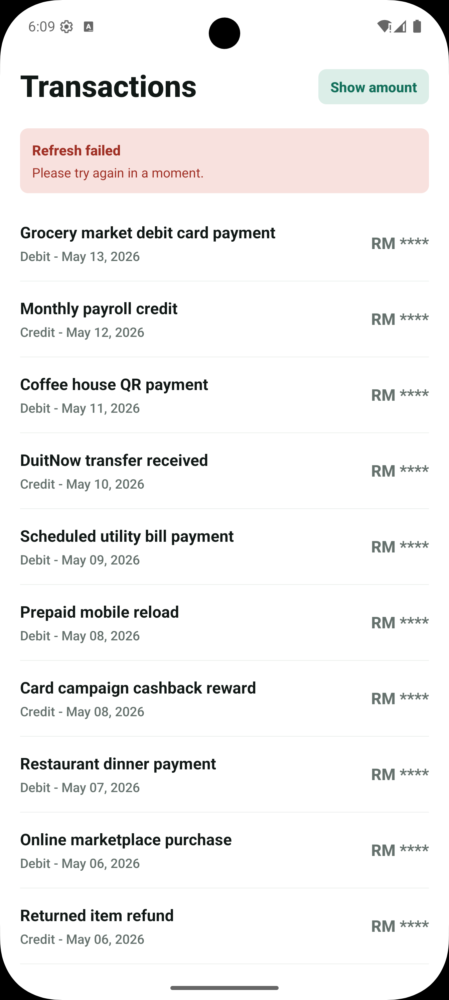

# Transaction History Mobile

Secure transaction history module built with Expo, React Native, and TypeScript.

## Table Of Contents

- [Review Summary](#review-summary)
- [Setup, Install, And Test The App](#setup-install-and-test-the-app)
- [Validation Commands](#validation-commands)
- [Screenshots](#screenshots)
- [Project Structure](#project-structure)
- [Mock Data](#mock-data)
- [Notes For Reviewers](#notes-for-reviewers)

## Review Summary

| Area                      | What is handled                                                                                         | Main decision                                                                                                       | Tech used                                                                         |
| ------------------------- | ------------------------------------------------------------------------------------------------------- | ------------------------------------------------------------------------------------------------------------------- | --------------------------------------------------------------------------------- |
| App runtime               | Native mobile app with iOS and Android development builds                                               | Use Expo for faster React Native development, simpler local builds, and managed native configuration                | Expo `~54.0.33`, Expo Dev Client `~6.0.21`, React Native `0.81.5`, React `19.1.0` |
| Type safety               | Transaction models, navigation params, and shared module contracts are typed                            | Keep route params explicit and keep transaction shape in the transaction module                                     | TypeScript `~5.9.2`                                                               |
| Navigation                | History screen and transaction detail screen                                                            | Use native stack navigation and pass only `transactionId` to details                                                | React Navigation `^7.2.4`, Native Stack `^7.15.0`                                 |
| Biometric authentication  | App unlock before history access and biometric approval before revealing amounts                        | Fail closed when biometrics are unavailable; no custom PIN/passcode fallback in this demo                           | Expo Local Authentication `~17.0.8`                                               |
| Sensitive amount masking  | Amounts are masked by default; revealing requires biometrics; hiding is immediate                       | Keep amount visibility in one context so history and detail stay in sync                                            | React Context                                                                     |
| Transaction data          | 30 mock transactions with amount, date, description, category, and type                                 | Store sample data as JSON and validate it at the service boundary before exposing it to the UI                      | JSON mock data, mock transaction service, TypeScript types                        |
| Data fetching and refresh | Initial loading, cached data, pull-to-refresh, and refresh failure state                                | Use server-state tooling even with mock data so the data flow matches an API-backed app                             | TanStack React Query `^5.100.10`                                                  |
| Detail lookup             | Detail screen reads the selected transaction from already loaded list data                              | Avoid a second transaction fetch for details in this scoped demo                                                    | React Query cache                                                                 |
| Error handling            | Initial load error, refresh error banner, invalid transaction data, auth failure, cancellation handling | Keep cached rows visible on refresh failure; keep amounts hidden on auth failure; do not alert on user cancellation | React Query state, controlled service errors                                      |
| UI and styling            | Responsive transaction rows, detail layout, loading skeletons, and shared visual tokens                 | Keep layout simple and module-focused, with shared color/spacing/radius tokens                                      | React Native, shared theme tokens                                                 |
| Code quality              | Formatting, linting, and TypeScript checks are configured                                               | Keep the project small and readable instead of adding broad state or validation libraries                           | ESLint `^9.39.4`, Expo ESLint config `~10.0.0`, Prettier `^3.8.3`                 |

## Setup, Install, And Test The App

### Testing Environment

Use a development build for review. This app uses native biometric authentication, and native permission configuration is applied through the generated iOS/Android build.

Tested with the environment below. These exact versions are not strict requirements, but they document the setup used to verify the app.

| Tool / Runtime                | Version used                 |
| ----------------------------- | ---------------------------- |
| macOS                         | `26.4.1`                     |
| Node.js                       | `25.2.1`                     |
| npm                           | `11.6.2`                     |
| Xcode                         | `26.3`                       |
| Android SDK Platform Tools    | `37.0.0`                     |
| Android Debug Bridge          | `1.0.41`                     |
| iOS biometric test target     | iOS Simulator Face ID        |
| Android biometric test target | Android Emulator fingerprint |

Review requirements:

- Use an iOS Simulator, Android Emulator, or physical device with biometrics enrolled.
- Use `npm install` so dependencies resolve from `package-lock.json`.
- Use a development build for biometric review.

Expo Go is not recommended for final review because it does not represent the app's generated native configuration.

### Install Dependencies

```bash
npm install
```

### Run On iOS

Before running the app, open an iOS Simulator and enable biometric enrollment:

```text
Simulator > Features > Face ID > Enrolled
```

Then install and launch the native development build:

```bash
npm run ios
```

This runs `expo run:ios`, which creates and installs the iOS development build. Use this instead of Expo Go so the Face ID permission configuration is included.

When the biometric prompt appears, use the Simulator menu to test success or failure:

```text
Simulator > Features > Face ID > Matching Face
Simulator > Features > Face ID > Non-matching Face
```

> Note: If the iOS prompt shows `Try Face ID Again`, click it and then choose `Matching Face` or `Non-matching Face` from the Simulator menu. This is native iOS Simulator behavior, not app-level retry handling; the simulator does not automatically produce a Face ID result.

### Run On A Physical iOS Device

Before running the app, make sure the iPhone has Face ID or Touch ID enrolled, then connect it to the Mac and trust the computer when prompted.

Install and launch the native development build on the device:

```bash
npm run ios -- --device
```

If Xcode asks for signing configuration, select a development team for the generated iOS project and run the command again.

### Run On Android

Before running the app, open an Android Emulator and enroll a fingerprint in Android system settings:

```text
Settings > Security > Fingerprint
```

Then install and launch the native development build:

```bash
npm run android
```

This runs `expo run:android`, which creates and installs the Android development build.

When the biometric prompt appears, use the emulator fingerprint controls to send a matching fingerprint.

### Run On A Physical Android Device

Before running the app, make sure the Android device has fingerprint or biometric unlock enrolled. Enable USB debugging, connect the device, and verify it is available:

```bash
adb devices
```

Install and launch the native development build on the device:

```bash
npm run android -- --device
```

If only one Android device or emulator is connected, `npm run android` can also install to that target.

### Start Metro Only

If the development build is already installed, start Metro without reinstalling the native app:

```bash
npm run start
```

### App Flow To Review

The app opens with a native biometric prompt. After successful authentication, the transaction history screen appears with amounts masked by default.

Tap `Show amount` to trigger a second biometric prompt before revealing transaction amounts. Debit amounts are shown in red and credit amounts in green. Tap `Hide amount` to mask amounts again without authentication.

Tap a transaction row to open the detail screen. The detail screen reuses the transaction already loaded in the list, shows the transaction details, and keeps amount visibility in sync with the history screen.

Pull down on the transaction list to refresh. The demo data is static, but the refresh path goes through React Query and the transaction service so it can be replaced with a real API later.

If biometrics are unavailable or not enrolled, the app stays locked and shows a retry screen instead of showing transaction data.

### Optional Error-State Review

Error states are implemented for initial load failure, refresh failure, and invalid local transaction JSON. They can be inspected during development by temporarily removing a required field from `src/modules/transactionHistory/test/mockTransactions.json`, then reloading the JS bundle and reverting that local change.

## Validation Commands

Run these commands before review:

```bash
npm run format:check
npm run lint
npm run typecheck
```

No automated unit test suite is included in this scoped demo.

## Screenshots

Native biometric prompts vary by platform and OS version.

### iOS

| Face ID prompt                                                                        | Loading state                                                                        | History masked                                                                                                        |
| ------------------------------------------------------------------------------------- | ------------------------------------------------------------------------------------ | --------------------------------------------------------------------------------------------------------------------- |
|  |  |  |

| History visible                                                                                                         | Transaction detail                                                                                          |
| ----------------------------------------------------------------------------------------------------------------------- | ----------------------------------------------------------------------------------------------------------- |
|  |  |

### Android

| Amount reveal prompt                                                                                                             | Refresh error                                                                                     |
| -------------------------------------------------------------------------------------------------------------------------------- | ------------------------------------------------------------------------------------------------- |
|  |  |

## Project Structure

```text
docs/
  screenshots/

src/
  navigation/
    AppNavigator.tsx
    routes.ts
    types.ts

  modules/
    auth/
      components/
      services/

    transactionHistory/
      components/
      hooks/
      navigation/
      screens/
      services/
      state/
      test/
      types/
      utils/

  shared/
    components/
    query/
    theme/
```

## Mock Data

The sample transactions are stored as plain JSON. The mock service imports the JSON, validates the shape at runtime, and exposes it through the `Transaction` type so the rest of the app can stay type-safe while keeping the test data easy to inspect or replace.

Mock transactions live in:

```text
src/modules/transactionHistory/test/mockTransactions.json
```

The mock service lives in:

```text
src/modules/transactionHistory/services/mockTransactionService.ts
```

The validator checks required fields, basic field types, valid date strings, positive finite amounts, and the `debit` / `credit` transaction type. If the JSON is invalid, the service throws a controlled error that is handled by the existing error UI.

The service is intentionally small so it can be replaced by a real API client without rewriting the screens.

## Notes For Reviewers

- The app is intentionally scoped to the transaction history module.
- Mock data is static, but loading and refresh are still routed through the service/query layer.
- Biometric behavior depends on simulator/device support and enrollment.
